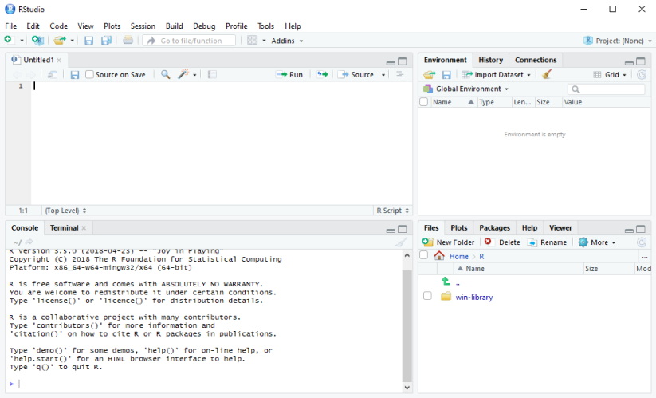

## R training for psychologists  

### This is practice code and dummy data for basic R training purposes. 

The aim of this repository is to help existing psychologists that are trained in SPSS to learn how to replicate those basic skills, but on R Studio.  

The objective is to guide you, step-by-step, through two examples of basic analyses that you might encounter from typical psychological intervention data and that you may have already conducted using SPSS.  

The first is a two-sample student's t-test using numerical data and the second is a chi-square test of association using categorical data.  

The aim is to illustrate, using those two worked examples, how R Studio works and introduce you to the process of writing analytical code. It is **not** intended to be a comprehensive introduction to statistics on R. Clearly, you would do more than this if you were doing a real analysis.  

> Just remember, the beauty of R is that you can tailor your analyses in a million different ways - don't take these examples as gospel! And don't be scared to try some coding of your own - you can always press CTRL+Z to undo your edits.

### STEP 1: Downloading and installing the neccessary stuff  
Here's where you want to go to get the software.  
**R**: https://cran.ma.imperial.ac.uk/  
**R Studio**: https://rstudio.com  

Create a folder somewhere easy to find on your computer. My recommendation is to create the folder **My Documents/R** and then a subfolder called /Training  
Download the data from this repository and move it into that folder.  
https://github.com/ianaelliott/training  

### STEP 2: Understanding a few basic "need-to-knows"  
- Any text that is prefixed with a hash (#) will be ignored by R, so you can use hash marks to annotate your code.  
- R is **CASE-SENSITIVE** so if you run into an error, check your spelling and/or capitalisations.  
- Copying and pasting code is not cheating: in fact, it's part and parcel of the collaborative nature of open-source stats!  
- To **run** code, either:  
  - place the cursor into a single chunk of code you want to run and hit Ctrl+Rtn  
  - select (highlight) chunks of code that you want to run and click the "Run" button  
  - place the cursor at the start and hit "Run": it'll run everything!  

> Remember: If at first you don't succeed, **COPY AND PASTE IT INTO A SEARCH ENGINE!** :) Seriously, whatever you've done I **guarantee** you, someone else has also done it and there's an explanation of how to fix it!  

### STEP 3: Familarising yourself with the typical R Studio layout
When you open R Studio, it should look a bit like this (but if it doesn - **don't worry**, it soon will!):  

     

Let's make sure you've got a .R file to write your code in. Either navigate to **File -> New File -> R Script** or press **CTRL+SHIFT+N**.  

Now you should have four quadrants:  
- **Top left**: This is your .R file, where you'll write and save your code. Why not give your file a title like ``## MY TRAINING CODE ##``   
- **Bottom left**: This is the console, where you'll see you code executed and get your data outputs.  
- **Top right**: This is your environment, where your data and other objects you've created will be listed.  
- **Bottom left**: This is your file structure, where you'll see the folder you're working from.  
    - It's also where your plots will go and where you can find in-software help.   
    
### STEP X: Set a working directory  
First, we need to tell R Studio where in our hard drive (or online) we need it to go to find the things we want to use (code, data, etc).

### STEP 4: Loading some data into R Studio  
We need to do two things here:
-   
- Import some data from that location.

Navigate to the "Go to Directory" button on the "Files" tab of the bottom-right pane (it should be the three dots). From there you can navigate to the folder in which you saved the data and the   

    mydata <- read.csv("prog-example-data.csv", header = T)  
    View(mydata)  
    

### STEP 5: Exploring the nature of the data

### STEP 6: 
